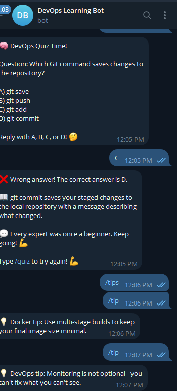

# 🤖 DevOps Learning Bot

A Telegram bot built with Python to help developers 
learn DevOps concepts through tips, quizzes, and 
roadmaps — containerized with Docker and deployed 
with CI/CD.

> Built by [0xApana](https://github.com/0xApana) 
> as part of a real DevOps learning journey.

---

## 📸 Preview



---

## ✨ Features

- 💡 Random DevOps tips by category
- 🧠 Interactive quiz with answer detection
- 💬 Motivational messages on every quiz answer
- 🗺 Full DevOps learning roadmap
- 📚 Curated learning resources
- 👨‍💻 Creator profile and links
- 🐳 Fully containerized with Docker

---

## 🛠 Tech Stack

| Tool | Purpose |
|------|---------|
| Python 3.12 | Bot logic |
| python-telegram-bot | Telegram API |
| Docker | Containerization |
| Docker Compose | Container orchestration |
| GitHub Actions | CI/CD pipeline |

---

## 📁 Project Structure
'''
devops-bot/
├── app/
│   ├── bot.py          # Main bot entry point
│   ├── commands.py     # Command handlers
│   └── tips.py         # DevOps tips database
├── Dockerfile
├── docker-compose.yml
├── requirements.txt
├── .env.example
├── .gitignore
└── README.md
'''

---

## 🚀 How to Run

### Prerequisites
- Docker installed
- Telegram Bot Token from @BotFather

### Steps

```bash
# Clone the repository
git clone https://github.com/0xApana/devops-bot.git

# Navigate into the project
cd devops-bot

# Create your .env file
cp .env.example .env

# Add your bot token to .env
BOT_TOKEN=your_token_here

# Build the Docker image
docker build -t devops-bot .

# Run the bot
docker run --env-file .env devops-bot
```

---

## 🤖 Bot Commands

| Command | Description |
|---------|-------------|
| /start | Welcome message |
| /tip | Random DevOps tip |
| /tip linux | Linux specific tip |
| /tip docker | Docker specific tip |
| /tip git | Git specific tip |
| /tip k8s | Kubernetes specific tip |
| /quiz | Random quiz question |
| /roadmap | DevOps learning roadmap |
| /resources | Learning resources |
| /about | About the creator |

---

## 💡 What I Learned

- Building async Telegram bots with Python
- Managing user session data with context
- Containerizing Python applications with Docker
- Writing clean modular Python code
- Deploying bots inside Docker containers

---

## 👤 Author

**Ridwanullahi Ali Apana — 0xApana**
Aspiring Cloud & DevOps Engineer

- GitHub: [@0xApana](https://github.com/0xApana)
- Fiverr: [apana0x](https://fiverr.com/apana0x)

---

## 📬 Try the Bot

Search **@devopslearning_bot** on Telegram and 
start learning DevOps today! 🚀
